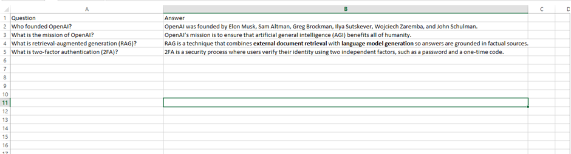
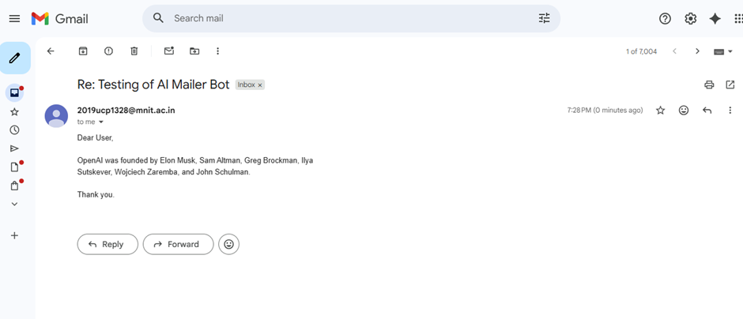
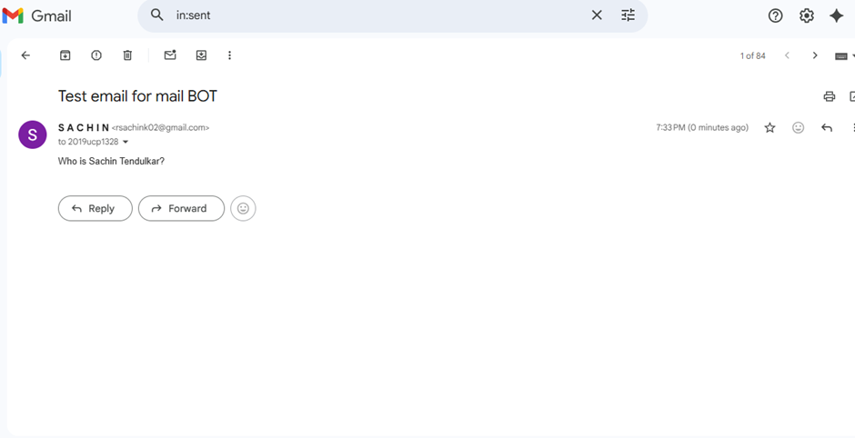
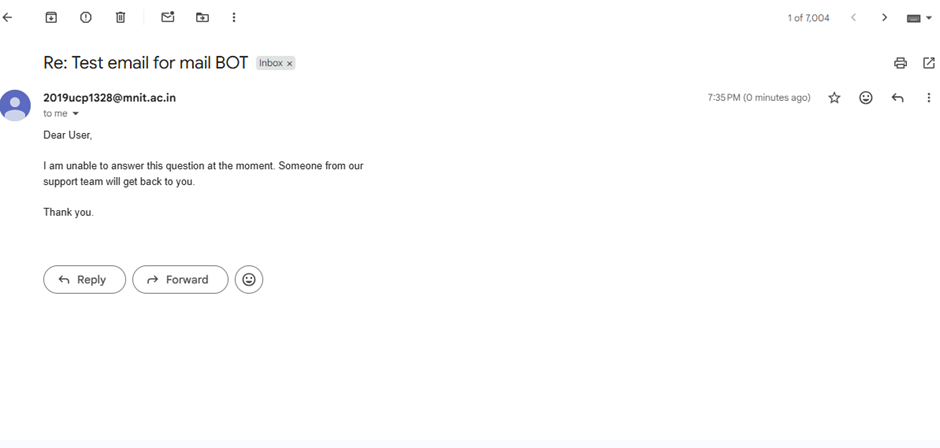

📈🤖 AIMailer – AI-Powered Email Automation

AIMailer is an AI-powered assistant that automates email processing, generates context-aware responses using AI, and integrates with a knowledge base for accurate answers. 

🚀 Features

📧 Automatic Email Processing – Fetch unread emails and extract user queries.

🧠 AI-Powered Responses – Use embeddings, RAG, and LLMs to generate accurate replies.

📚 Knowledge Base Integration – Search FAQs, documents, and internal resources.

⚡ Workflow Automation – Update email status (read/replied/pending) automatically.

🛠 Tech Stack

 </a>  
🧱 Project Structure
AI Mailer Bot
│
├── faq.xlsx               # Your FAQ database
├── faq.index              # FAISS Vector Index (auto-created)
├── token.json             # Gmail API token (auto-generated)
├── credentials.json       # Gmail OAuth credentials (you provide)
├── main.py                # AI Mailer BOT script
└── README.md              # Project documentation

🔧 Setup Instructions

1️⃣ Clone the repository

git clone https://github.com/<username>/<repo>.git

2️⃣ Create & activate virtual environment

python -m venv venv
source venv/bin/activate     # Mac/Linux
venv\Scripts\activate        # Windows

Installation & Setup
1️⃣ Install Python Dependencies
pip install openai google-api-python-client google-auth google-auth-oauthlib google-auth-httplib2 faiss-cpu pandas numpy

2️⃣ Setup Gmail API Credentials

Go to Google Cloud Console
.

Enable Gmail API.

Create OAuth client ID → Desktop App.

Download credentials.json into the project folder.

3️⃣ Add Your FAQ Excel File

Create faq.xlsx with columns: Question and Answer.

4️⃣ Add OpenAI API Key

In the script:

OPENAI_API_KEY = "your-key-here"

Or via environment variable:

export OPENAI_API_KEY="your-key-here"

▶️ Running the BOT
python main.py

On first run, a browser window opens for Gmail login.

token.json is generated automatically.

Subsequent runs do not require login.

🔄 Workflow

Load FAQ Excel

Build or load FAISS vector index

Authenticate Gmail

Fetch unread emails

Extract user query

Search similar FAQ (FAISS)

Generate reply using GPT-3.5-turbo

Send reply via Gmail

Mark email as read

🧙 Configurable Parts
Filter Emails by Sender or Subject
query = "is:unread from:rsachink02@gmail.com"

Other options:

is:unread
is:unread subject:HR
from:*@company.com

FAISS Match Threshold
threshold = 2  # Lower → stricter, Higher → more lenient

Change GPT Model
model="gpt-3.5-turbo"  # Replace with other GPT models if needed
🖥️ How It Works

Fetch Emails: Reads unread emails using Microsoft Graph API.

Extract Queries: Parses email content to extract user queries.

Retrieve Knowledge: Performs similarity search on FAQs or documents using embeddings.

Generate Response: AI creates context-aware replies using RAG & LLM.

Send Reply: Sends email and updates status automatically.

Track & Analyze: Stores query, response, and confidence in MySQL.

📷 Screenshots

🎯 Use Cases

Automate customer support emails

Streamline sales workflow

Extract knowledge from internal documents

Track query-response analytics
